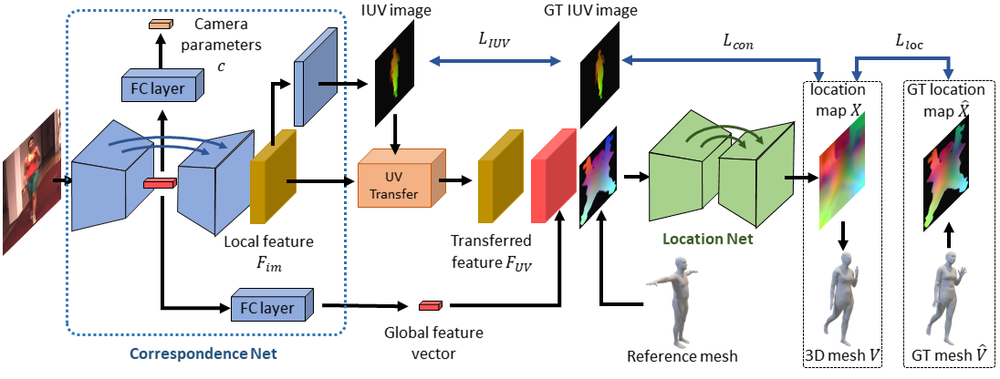

# DecoMR
Code repository for the paper:  
**3D Human Mesh Regression with Dense Correspondence**  
[Wang Zeng, Wanli Ouyang, Ping Luo, Wentao Liu, Xiaogang Wang]  
CVPR 2020  
[[paper](https://arxiv.org/pdf/2006.05734.pdf)]

.

## Installation instructions
This project is tested on ubuntu 16.04 with python 3.6, PyTorch 1.1. We recomend using Anaconda to create a new enviroment:

```
conda create -n DecoMR python=3.6
conda activate DecoMR
```

Install dependecies: This project utilizes OpenDR to render 3D mesh. 
In order to install OpenDR on Python 3.6, libosmesa6-dev needs to be installed first：
```
sudo apt-get install libglu1-mesa-dev freeglut3-dev mesa-common-dev
sudo apt-get install libosmesa6-dev
sudo apt-get install gfortran
pip install --force-reinstall pip==19
pip install -r requirements.txt
```

After finishing with the installation, 
you can continue with running the demo/evaluation/training code. 
If you want to do the evaluation on Human3.6M, 
you also need to manually install the 
[pycdf package of the spacepy library](https://pythonhosted.org/SpacePy/pycdf.html) 
to process some of the original files. 
If you face difficulties with the installation, 
you can find more elaborate instructions 
[here](https://stackoverflow.com/questions/37232008/how-read-common-data-formatcdf-in-python).

## Fetch data
In order to run our code, you need to download some additional 
file [here](https://drive.google.com/drive/folders/1xWBVfQa7OZ14VgT9BVO9Lj_kDqRAcQ-e?usp=sharing).
This package contains neccessary files for UV mapping function and a model trained on Human3.6M + UP-3D.
After unzip the files, you need to put the folder under this project. 

In addition, you need to fetch the neutral SMPL model from the 
[Unite the People repository](https://github.com/classner/up):
```
wget https://github.com/classner/up/raw/master/models/3D/basicModel_neutral_lbs_10_207_0_v1.0.0.pkl --directory-prefix=data
```
The model falls under the SMPLify license. 
If you find this model useful for your research, please follow the 
[corresponding citing insturctions](https://github.com/classner/up/tree/master/3dfit/README.md).

In order to perform the evaluation on 3DPW or SURREAL dataset, you also need to get the 
[male and female models](http://smpl.is.tue.mpg.de).
 Please go to the websites for the corresponding projects and register 
 to get access to the downloads section.

## Run demo code
To run our method, you need a bounding box around the person. 
The person needs to be centered inside the bounding box and 
the bounding box should be relatively tight. 
You can either supply the bounding box directly or provide an
 [OpenPose](https://github.com/CMU-Perceptual-Computing-Lab/openpose) detection file. 
 In the latter case we infer the bounding box from the detections.

In summary, we provide 3 different ways to use our demo code and models:
1. Provide only an input image (using ```--img```), in which case it is assumed that
 it is already cropped with the person centered in the image.
2. Provide an input image as before, 
together with the OpenPose detection .json (using ```--openpose```). 
Our code will use the detections to compute the bounding box and crop the image.
3. Provide an image and a bounding box (using ```--bbox```). 
The expected format for the json file can be seen in ```examples/im1010_bbox.json```.

Example with OpenPose detection .json
```
python demo.py --checkpoint=data/model/h36m_up3d/checkpoints/h36m_up3d.pt --config=data/model/h36m_up3d/config.json --img=examples/im1010.jpg --openpose=examples/im1010_openpose.json
```
Example with predefined Bounding Box
```
python demo.py --checkpoint=data/model/h36m_up3d/checkpoints/h36m_up3d.pt --config=data/model/h36m_up3d/config.json --img=examples/im1010.jpg --bbox=examples/im1010_bbox.json
```
Example with cropped and centered image
```
python demo.py --checkpoint=data/model/h36m_up3d/checkpoints/h36m_up3d.pt --config=data/model/h36m_up3d/config.json --img=examples/im1010.jpg
```

Running the previous command will save the results in ```examples/im1010_{render, render_side}.png```. 
The file ```im1010_render.png``` shows the overlayed reconstructions of the non-parametric shapes.
The file ```im1010_render_side.png``` shows the mesh in the side view.

## Run evaluation code

We provide code to evaluate our models on the datasets we employ for our empirical evaluation. 
Before continuing, please make sure that you follow the 
[details for data preprocessing](datasets/preprocess/README.md).

Example usage:
```
python eval.py --checkpoint=data/model/h36m_up3d/checkpoints/h36m_up3d.pt  --dataset=h36m-p1 --log_freq=20
```
Running the above command will compute the MPJPE and MPJPE-PA on the Human3.6M dataset (Protocol I). The ```--dataset``` option can take different values based on the type of evaluation you want to perform:
1. Human3.6M Protocol 1 ```--dataset=h36m-p1```
2. Human3.6M Protocol 2 ```--dataset=h36m-p2```
3. UP-3D ```--dataset=up-3d```
4. LSP ```--dataset=lsp```
5. 3DPW ```--dataset=3dpw```
6. MPI-INF-3DHP ```--dataset=mpi-inf-3dhp```
6. SURREAL ```--dataset=surreal```

## Run training code
Due to license limitiations, we cannot provide the SMPL parameters for Human3.6M 
(recovered using [MoSh](http://mosh.is.tue.mpg.de)). 
So you may need to get the training data of Human3.6M by yourself.

The training process is two-stage. In the first stage, the correspondence net is trained.
Example usage:
```
python train.py --name=sample_dp --stage=dp --num_epoch=5
```
Running the above command will start the training process of the Correspondence Net.
It will also create the folders `logs/sample_dp` that is used to save model checkpoints 
and Tensorboard logs.
If you start a Tensborboard instance pointing at the directory `logs/sample_dp/tensorboard`, 
you should be able to look at the logs stored during training.

In the second stage, the pretrained Correspondence Net is loaded 
and trained with the Location Net end-to-end. Example usage:
```
python train.py --name=sample_end --stage=end --pretrained_checkpoint=logs/sample_dp/checkpoints/final.pt
```

Running the above command will start the training process of the full model. 
It will create the folders `logs/sample_end` to save model checkpoints and Tensorboard logs.

The default training pararmeters use 8 gpus and the default batch size is 128. 
You can change the setting by resetting `--ngpu` and `--batch_size`.
You can view the full list of command line options by running `python train.py --help`. 
The default values are the ones used to train the models in the paper. 

## Latest Update
### 2020.09.01
We recently added the training and evaluation code on several datasets:
[SURREAL](https://www.di.ens.fr/willow/research/surreal/data/),
[3DPW](https://virtualhumans.mpi-inf.mpg.de/3DPW/) and 
[MPI-INF-3DHP](http://gvv.mpi-inf.mpg.de/3dhp-dataset/). 
You can get the preprocess details from [here](datasets/preprocess/README.md).

We add the training code to use the
 [SPIN fits](http://visiondata.cis.upenn.edu/spin/spin_fits.tar.gz) 
 as supervision and provide the 
 [pretrained models](https://drive.google.com/drive/folders/1xWBVfQa7OZ14VgT9BVO9Lj_kDqRAcQ-e?usp=sharing).

### 2020.09.24
We fixed the bug of the gender label in 
[SURREAL](https://www.di.ens.fr/willow/research/surreal/data/) dataset, 
and retrained the model on SURREAL dataset.

If you are using the codes updated on 2020.09.01, 
you need to delete the annotation files of SURREAL dataset 
(`surreal_train.npz` and `surreal_val.npz`) and then 
run `preprocess_extra_datasets.py` again to get the right gender labels. 

Fortunately, you do NOT need to remove the rendered IUV images of SURREAL dataset, 
because the rendered IUV images are with right gender labels.
So the preprocess won't take too much time.


## Citing
If you find this code useful for your research, please consider citing the following paper:

	@Inproceedings{zeng20203d,
	  Title={3D Human Mesh Regression with Dense Correspondence},
	  Author={Zeng, Wang and Ouyang, Wanli and Luo, Ping and Liu, Wentao and Wang, Xiaogang},
	  Booktitle={CVPR},
	  Year={2020}
	}

## Acknowledgements
Part of the code and data are adapted from
([Graph-CMR](https://github.com/nkolot/GraphCMR), 
[DenseBody](https://github.com/Lotayou/densebody_pytorch),
[SPIN](https://github.com/nkolot/SPIN)) .
We gratefully appreciate the impact they had on our work. 

We also appreciate [wangzheallen](https://github.com/wangzheallen) for
making the installation easier.